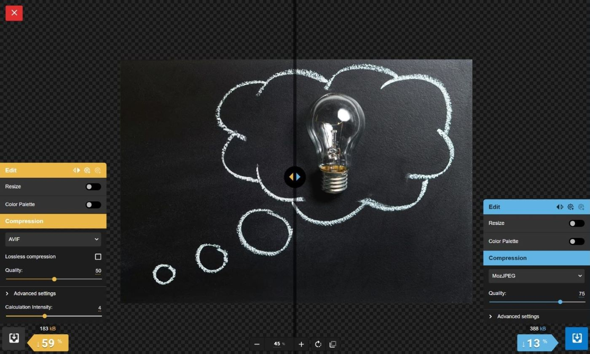

<p align="center">  
  <a href="https://github.com/gigamaster/codemo">
  
  </a>
</p>

<h2 align="center">
<br />
///// — CODEMO DIGITAL NOMAD — \\\\\
<br /><br />
</h2>

[](https://gigamaster.github.io/codemo/)

# [codemo-optimize]

[codemo-optimize] is an image compression web app that reduces image sizes through numerous formats.  

Codemo-optimize is a customized edition os Squoosh.

## Privacy

Codemo-optimize does not send your image to a server. All image compression processes locally.

**All tracking and analytics have been removed for your privacy.**  

This version does not collect any visitor data, image size metrics, or installation information.

## Developing

To develop for Smaller:

1. Clone the repository
   ```sh
   git clone https://github.com/gigamaster/codemo-image-optimize.git
   ```
2. To install node packages, run:
   ```sh
   npm install
   ```
3. Then build the app by running:
   ```sh
   npm run build
   ```
4. After building, start the development server by running:
   ```sh
   npx serve -l 5001 build
   ```

## Codemo Digital Nomad

A collection of web apps for creatives and developers on the go. Features a live code playground, vector graphic editor, and a repository browser to preview, edit, and and download individual files or directories as ZIP archives. Built with localStorage for user-configurable settings and running entirely in the browser.


[codemo-optimize]: https://gigamaster.github.io/codemo/